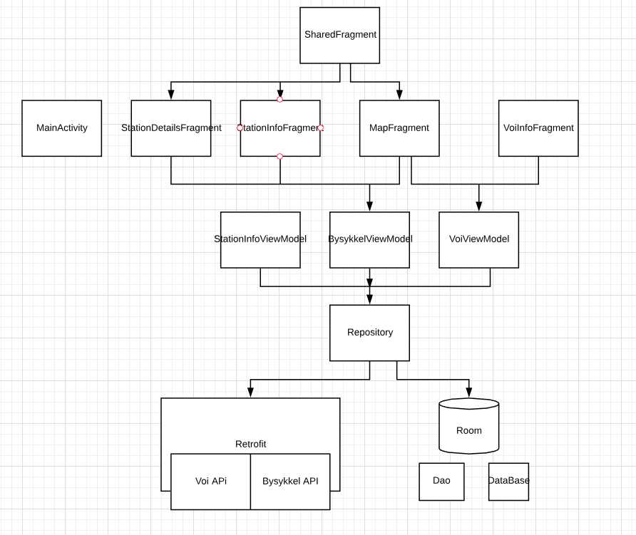

# Dokumentasjon - Der

## Om Oppgaven

Dette er en av to eksamensoppgaver gitt ved Høyskolen Kristiania i faget, PGR202 - Android Programmering, våren 2019

### Krav til innhold

- [x] Applikasjonen skal ha et tydelig definert konsept og formål
- [x] Applikasjonen skal ha en Fragment-arkitektur.
- [x] Applikasjonen skal gjøre bruk av et eksternt API (Firebase oppfyller ikke pkt 4.).
- [x] Applikasjonen skal gjøre bruk av en lokal database.
- [x] Applikasjonen skal ha multimedia innhold.
- [x] Applikasjonen skal ha lokasjonsdata og/eller kart.
- [x] Applikasjonen skal gjøre bruk av sensordata

### Krav/mål

1. Løsningen skal følge Android sine designprinsipper, samt arkitektur- og
kodestandarder.
2. Løsningen skal beskrives i et tekstdokument, hvor du skal diskutere styrker og
svakheter, forklare kodefilene som er lagt med og begrunne valgene du har gjort.
3. Arkitektur og flyt av applikasjonen skal modelleres og beskrives.
4. Screenshots av alle skjermflater skal legges i rapporten.

### Ekstrapoeng

Det er tre muligheter for å skaffe ekstrapoeng i oppgaven. Disse poengene vil telle som
bonus og / eller kunne veie opp for eventuelt andre mangler i punktene 1-7 i kravlisten over.
1. Betydelig vektlagt estetikk, design og utforming av applikasjonen.
2. Applikasjonen er lansert til Google Play store (evt Beta).
3. Utførlig dokumenterte enhetstester, systemtester og brukertester.

## Bakgrunn for hvorfor jeg ville lage "Der"

I Oslo og andre storbyer dukker det hyppigere opp nye tjenester befolkningen kan benytte seg av. Man har
Uber, Taxifix, Ruter, Nsb, Flytoget, Voi, Tier, Bysykkel, osv. Alle disse har egne apper man bruker til å
booke, låse opp, kjøpe, bestille, sjekke tider osv. Mange bygger sine tjenester på teknologi som lett kan skaleres. 
Det er også stort fokus på data og åpne data og flere av disse har derfor tilgjengliggjort store deler av 
dataen sin i form av åpne API'er. Med dette er det mulig å lage egne skreddersydde løsninger. Om det så er
en smartskjerm i gangen eller en kommersiell tjeneste. 

I hele 2018 gjorde jeg API kall mot Oslo Bysykkel sine API'er for å samle inn informasjon som antall sykler
og låser tilgjengelig i hvert stativ i Oslo. Dette for å se på muligeheten til å gjøre estimeringer på stativ
når det gjelder tilgjengelige sykler til gitte tider per stativ. 

Jeg er en aktiv bruker av Oslo Bysykkel, men i 2019 har også blitt hyppig bruker av Voi og Tier, som driver med
utleie av el-sparkesykler. Så et kjent scenario for meg er at jeg åpner Oslo Bysykkel sin app. Sjekker om det er
stativer i nærheten med ledige sykler. Om det er det, går jeg dit. Hvis ikke åpner jeg Voi eller Tier sine
apper. Sjekker om det er tilgjengelige el-sparkesykler i nærheten. Om det er det, går jeg dit. Men ofte er det slik 
at ingen av de tre har tilbud der og da som passer meg. Det er for langt eller ingen gode alternativer i det hele tatt.

Derfor har jeg laget appen, Der. Jeg kan da åpne Der for å få informasjonen i en og samme app. Og kommer det flere
tilbydere er det bare å integrere seg mot deres API i tillegg, gitt at de har åpne API'er.

## Beskrivelse av appen "Der"

Der er en app hvor man kan finne informasjon fra transporttilbydere i Oslo med åpne API'er. I første versjon er det
informasjon Oslo Bysykkel og VOI som er tilgjengelig. Man finner i dag live data for alle sykkelstativene til Oslo
Bysykkel, samt strømnivået og posisjonen til alle sparkesyklene til VOI. 

Bruker åpner appen og møter et kart over Oslo med oransje og blå markører. Disse endrer størrelse basert på zoom-nivået til
kartet. De blå markørene er hvor Oslo Bysykkel stativene er, mens de oransje er VOI-sparkesykler. Trykker man på en blå markør
får man opp nåtidsdata på det respektive bysykkel stativet. Da kan bruker trykke på "Details" eller "Bysykkel APP". Ved å
trykke på "Bysykkel APP" trigger det en Intent som sender brukeren til Bysykkel Appen om den har den installert. Trykker bruker
på "Details" vil den få opp en side med utvidet statistikk for det stativet(nå er det fylt med testdata. 

Her inne er det et lite "Easter-egg". Rister man telefonen her kan man ta et bilde som vil lagre seg på intern-storage
og brukes som bilde i selve details siden for det bysykkel stativet i appen i fremtiden. 

Ved å trykke på oransje markør i kartet får bruker opp informasjon om hvor mye strøm det er på den respektive sparkesykkel. Bruker får
da mulighet til å trykke på "VOI app" Det vil trigge en Intent som sender bruker til VOI sin app, om den er installert.  

Ned på navigeringsbaren kan bruker også trykke på en listetab. Den viser en liste over alle bysykkel stativ med distanse til
stativet. Bruker kan her trykke på "Details" og "Bysykkel App" som gjør det samme som beskrevet over. 

### Tilleggsinformasjonen om dagen versjon av appen

For alle bysykkelstativene er det også en detaljert side med data som gjennomsnitt sykler i stativet og prosentdel av tiden
sist måned det har vært sykler i stativet. Denne er i dag laget av testdata. Jeg jobber med å erstatte
dette med ekte data, men klargjøringen av dataene ble ikke helt ferdig og jeg valgte derfor å ta det med i denne runden.

## Arkitektur

Jeg har valgt å bygge appen med MVVM design pattern. MVVM står for Model View View Model. Det er mange fordeler
ved å bruke et design pattern som MVVM og MVP (Model View Presenter). Et av de er at man får separert logikk
som ikke bør være tett koblet. F.eks. skal ikke appen nødvendigvis trenge å vite om dataen kommer fra
lokal lagring eller fra et nettverkskall. Om man abstraktherer lagene og separerer ansvar er det lettere
å holde styr på logikk, flyt i applikasjonen og ikke minst, klare å holde styr på kodebasen. 

M = Model, altså data class
V = View, altså det vi ser. Fragment, textView, imageView
VM = ViewModel, altså hvor data-state holdes, samt logikk.

MVVM er et kjent pattern og mye brukt pattern. Ved å bruke et kjent pattern er det enkelt(enklere) for eksterne
å sette seg inn i kodebasen, det er ryddigere å jobbe flere på samme kodebase og man minimerer faren for å 
opparbeide seg teknisk gjeld.

### Der diagram

### Fragments
Applikasjonen er bygd opp med Fragment arkitektur hvor MainActivity har en fragment som fungerer som en placeholder for 
fragmentsene. Dette er implementert med Navigation Component som er beskrevet og illusert under. 

### Tekniske valg

#### AndroidX
Jeg har valgt å benytte meg av AndroidX biblioteker da dette har tatt over support biblioteket. Med AndroidX har 
har Google prøvd å sørge høyere kompabilitet mellom sine biblitoker. Tidligere har det vært forvirrelser rundt navn på Android biblioteker med
versionsnummer og pakkenavn. Ved AndroidX vil de altså prøve å forbedre dette. Android Studio har også en fin knapp under
"Refactor" som heter "Migrate to AndroidX". Da erstatter Android Studio alle dependencies fra Android til AndroidX
på en "trygg måte". Man får spørsmål om å sikkerhetskopiere prosjektet sitt først.

AndroidX kommer med Jetpack, som er en pakke av biblioteker som er anbefalt av Google. Jetpack skal hjelpe utviklere til å 
eliminere boilerplate kode og samt være effektive i utviklingen av applikasjoner.

Kilde: [Medium Artikkel om AndroidX og Jetpack](https://medium.com/ta-tonthongkam/android-jetpack-android-x-36c73abff1c5)

#### Minimum SDK Versjon
Jeg valgte å sette minSdkVersion til 26 ettersom Google Playstore nå krever at alle apper som blir utgitt minimum har SDK versjon 26.

#### Navigation Component
Navigation Component er en del av Jetpack og lar deg navigere mellom deler av appen på en lett og ryddig måte. Koden er lett å
implementere og lett og forstå. Man kan drag n' droppe actions mellom activities og fragments i et graph system. Disse actionsene
får en ID man kan trigge ved f.eks. onClicks. En action er f.eks. bytte mellom to fragments. 

I tillegg får man god hjelp til å håndtere back stack, deep linking og animations og transitions. 

##### Her er et eksempel av hvordan jeg har tegnet opp actions mellom fragments i nav-graph i Android studio:

Kilde: [Navigation Component](https://developer.android.com/guide/navigation)

#### Room
Room er en del av Jetpack. Room gir et abstraksjonslag over SQLlite. I min app bruker jeg Room til å lagre Bysykkel stativene i den 
lokale databasen på telefonen. Ved oppstart sjekker jeg om det er tilgjengelig i databasen. Er det ikke tilgjengelig gjøres det nettverkskall. 
Er det tilgjengelig hentes stativene fra databasen.  Med Room lager med en database klasse man annoterer med @Database, en eller flere entiteter(Data classes) man
annoterer med @Entity og en eller flere DAO klasser man annoterer med @Dao. Jeg fant det svært hyggelig å jobbe med Room.

Kilde: [Android Developer - Room](https://developer.android.com/training/data-storage/room/index.html)

#### Retrofit
Retrofit er et eksternt bibliotek jeg ønsket å ta i bruk da jeg har lest mye bra om det, samt så en talk på sist Mobile Era konferanse. 
Retrofit brukes til å gjøre HTTP-kall. Man lager et Retrofit objekt og gir den forskjellige adaptere, f.eks. Gson, som jeg gjorde,  til parsing av 
JSON. Men man kan også gi benytte seg av Jackson om man heller ønsker det. En av styrkene til Retrofit er at de har gjort det enkelt å 
bruke det med andre biblioteker, som f.eks. RxJava. 

Jeg brukte Retrofit til å gjøre HTTP-kall for å konsumere data fra API'et til Oslo Bysykkel og fra VOI. 

###### Her er implementasjonen for bysykkel-endepunktene

#### RxJava2
RxJava er et bibliotek fra ReactiveX. Med RxJava kan man observere data fra kilder, og utfra resultatet av datastrømmen gjøre handlinger i koden.
Som f.eks. jeg har gjort i denne appen. Når jeg bygde Retrofit objektet mitt, ga jeg den en RxJava2Adapter slik at jeg da kan be Retrofit
returnere datatypten "Single" fra HTTP-kallet. I min BysykkelViewModel kan jeg enkelt med RxJava observere datastrømmen på en bakgrunnstråd, mens
jeg subscriber på UI-tråden. Om onSuccess callbacket ble kalt, hentet jeg ut dataene fra Single og brukte det i videre i applikasjonen. Samtidig kan man
gjøre handlinger basert på om onError blir kalt. 

Jeg valgte å bruke RxJava hovedsaklig for at det kan være utfordrende å gjøre tunge oppgaver som må gjøres på bakgrunnstråder, for så å binde resultetet 
av innhenting opp mot views. Alternativer er AsyncTask, men etter å lest om hva Androidutviklere bruker i sitt virke, ble jeg nysgjerrig og ville 
se på RxJava2. 

Jeg bruker RxJava med Retrofit for all datainnhenting i min applikasjon. I tillegg bruker jeg RxJava til å binde opp mot viewsene i RecyclerView
og adapteren.  

RxJava har god støtte for å forhinde memory leaks ved å benytte Composite Disposal ved observering. Dette er implementert i min kode i viewModel.

###### Her er RxJava fra bysykkelViewModel

Kilde: [RxJava - Github](https://github.com/ReactiveX/RxJava)

#### MapBox
MapBox er et open source bibliotek for kart. For Android, iOS og JavaScript. Jeg har tidligere lest om det og ser at flere apper med kart i dag
bruker MapBox. Jeg valgte derfor å prøve det. Det var enkelt å komme i gang og dokumentasjonen var god. 

I mitt kart har jeg forskjellige markører for Bysykkel og Voi. Om størrelsene på markørene endrer seg basert på zoom-nivået. Dette for å optimalisere
for brukeropplevelse.

Kilde: [MapBox - Android](https://www.mapbox.com/mapbox-android-sdk-legacy/)

#### Stetho
Stetho har jeg brukt for debugging av den lokale databasen. Med en linje kode i MainActivity får man tilgang til applikasjonens databse og 
local storage i et web view.

Kilde: [Stetho - Github](http://facebook.github.io/stetho/)

#### CameraKit
Jeg ønsket å kunne la bruker ta bilde av bysykkel stasjoen de var ved for så å lagre det i detalj viewet. Med det så var det nødvendig å benytte
et kamera API. Jeg falt da på CameraKit. CameraKit lar en enkelt benytte kamera på telefonen ved at man legger CameraKit til i XML fila. Så
konfigurer man kamera sine innstillinger med attributter der. F.eks. aspectRatio, setFlash, gestureLstener etc. 

Kilde: [CameraKit](https://camerakit.io)

### Design
Jeg har ikke brukt mye tid på design annet enn at jeg har brukt klare farge for å skille mellom kategoriene. Til menyen og 
detaljesidene har jeg brukt kjente standard ikoner som bruker lett kjenner igjen. 

Har fokusert på ryddighet fremover flott design. F.eks. er markørene sin størrelse bestemt ut fra zoom-nivå. Markørene har 4 forskjellige
størrelser. 

Alle layouts er laget med Constraint Layout. Da står man fritt til å plassere ut views i layouten. 

## Styrker og Svakheter

### Svakheter

- Design kunne vært bedre
- Kun to tjenester i appen
- Mye av funksjonalitet er bygget på tredjeparts biblioteker
- Henter kun data ved oppstart av appen

### Styrker

- Ikke komplisert å legge til flere tilbydere av like tjenester
- Bygget på MVVM, som gjør det enklere å vedlikeholde og utvide
- Bygget på Android sine design prinsipper
- Ingen kjente memory leaks. Har stresstestet applikasjonen i Profileren
- Enkelt å gjøre om dataflyt fra kun oppstart til kontinuerlig da brukte bibliotek(RxJava og Retrofit) har god støtte for dette
- Helheltlig navngivning:
    - Fragments: MapFragment
    - Activity: MainActivity
    - View: <type-view><navn-på-layout><hva-er-formålet-for-view>
        - Eks: button_fragment_map_open_marker, textView_fragment_station_details_item_station_details_percentage_bikes_day

## Flyt

* Ved oppstart av appen gjøres det to HTTP-kall, et til bysykkel og et til VOI
* Data returneres og det lages objekter fra responsen med hjelp av Gson som parser til riktig type
* MapFragment har BysykkelViewModel og VoiViewModel som igjen observer datastrømmen fra HTTP-kallene. MapFragmentet
    tegner da markers utfra dataen i ViewModelene
* MapFragment ønsker brukers lokasjondata og ber om den ved oppstart. Hvis den får det, tegner opp bruker som markers
    på mappet
* Om bruker trykker på markers, åpnes det info-vinduer for VOI eller Bysykkel. Disse bruker data fra StationInfoViewModel.
    StationInfoViewModel "SharedFragment" og brukes for å holde staten til valgt bysykkel stativ når vi går til StationDetails fra info-vindu.
* Her kan bruker trykke seg inn på StationDetailsFragment for bysykkel. Her kan bruker riste telefonen for å lagre et
    bilde for stasjonen. Dette ansees som et "easter-egg"
* Fra StationDetailsFragment og info-vinduene kan bruker navigere seg til Bysykkel eller VOI appen. 
* På navigationbar kan bruker trykke på "Details" med et sykkelikon. Her er en liste over alle stativene i oslo med link til
    bysykkelpp eller detaljeside om bysykkelstativet
    

# Skjermbilder fra app

## APP: Der

#### Ved åpning av app

#### Ved trykk på blå marker dukker StationDetailsFrament opp

#### Ved trykk på details kommer detalj siden til bysykkel stativet

#### Om man rister enheten inne på detalj siden (easter-egg), åpnes Camera Fragment for å ta bilde til bysykkel detalj siden

#### Ved trykking på oransj marker dukker det opp VOI Info Fragment

#### Ved trykking på Details vises bysykkel stasjoner i recycler view

